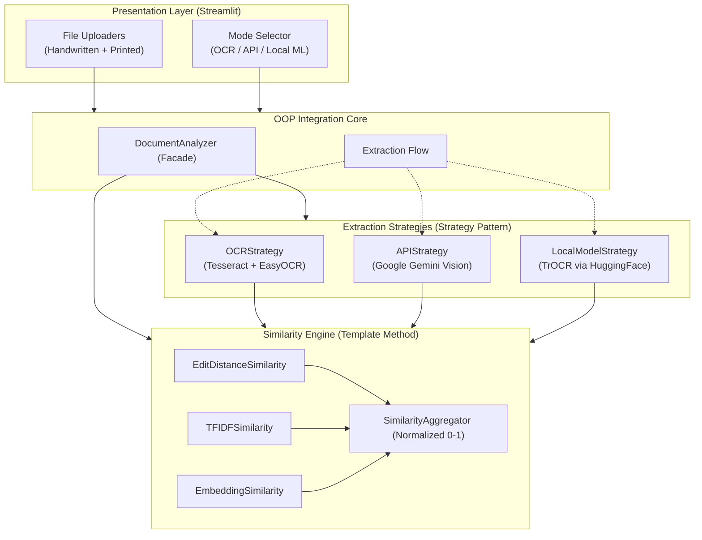

# System Architecture & Design

The Document Similarity Analyzer is strictly designed adhering to **Object-Oriented Programming (OOP)** principles to remain modular, scalable, and easily extensible.

## Component Overview

The application utilizes Streamlit for its Presentation Layer and delegates logic to a strongly decoupled OOP core.

## OOP Design Patterns Implemented

The architecture leverages classic Gang of Four (GoF) design patterns to establish highly decoupled dependencies.

### 1. Strategy Pattern (`models/extraction/`)
* **Problem**: We have three vastly different methods to extract text (Traditional OCR algorithms, Cloud LLM Vision APIs, Local HuggingFace ML models) that need to be hot-swapped by the user via the UI.
* **Solution**: Define an interface `ExtractionStrategy` with a common `extract_text` method. The concrete implementations (`OCRStrategy`, `APIStrategy`, `LocalModelStrategy`) inherit from this and execute their specific libraries. The context object knows nothing about `pytesseract` or `transformers`.

### 2. Factory Pattern (`models/extraction/factory.py`)
* **Problem**: The UI passes a string indicating the chosen mode. Instantiating the complex strategy dependencies requires central logic.
* **Solution**: `StrategyFactory.create(mode, **kwargs)` takes the UI's string input and returns the correct `ExtractionStrategy` instance, handling any required parameter routing (like injecting the API key).

### 3. Template Method Pattern (`models/similarity/`)
* **Problem**: We compute similarity using different math formulas (Levenshtein distance versus Cosine Similarity), but the lifecycle is always the same: validate text -> compute raw score -> clamp bounds to [0.0, 1.0].
* **Solution**: `SimilarityMetric(ABC)` implements the `compute()` method which dictates the step sequence (validation and bounds clamping) and delegates the core computation to the abstract method `_compute_raw()`. Concrete classes only implement `_compute_raw()`.

### 4. Facade Pattern (`models/analyzer.py`)
* **Problem**: Managing extraction across multiple files (`doc1`, `doc2`) and routing results to the `SimilarityAggregator` would clutter Streamlit's `app.py`.
* **Solution**: `DocumentAnalyzer` provides a single entry point (`analyze()`) that orchestrates the entire pipeline — hiding the complexity of strategy execution and multi-metric aggregation from the presentation layer.

## Request Flow

1. User uploads `<File>` objects in UI.
2. `FileHandler` utility translates byte streams into `List[PIL.Image]`.
3. `StrategyFactory` receives user's selected mode string and constructs the specific `ExtractionStrategy`.
4. `DocumentAnalyzer` (Facade) takes the parsed images, applies the strategy to extract raw strings.
5. Text strings pass through the `TextPreprocessor` for whitespace formatting and artifact mitigation.
6. Clean strings are dispatched to `SimilarityAggregator`, which polls `EditDistance`, `TF-IDF`, and `Embeddings` models.
7. Final Normalized Dictionary is returned back up to UI for metric rendering.
