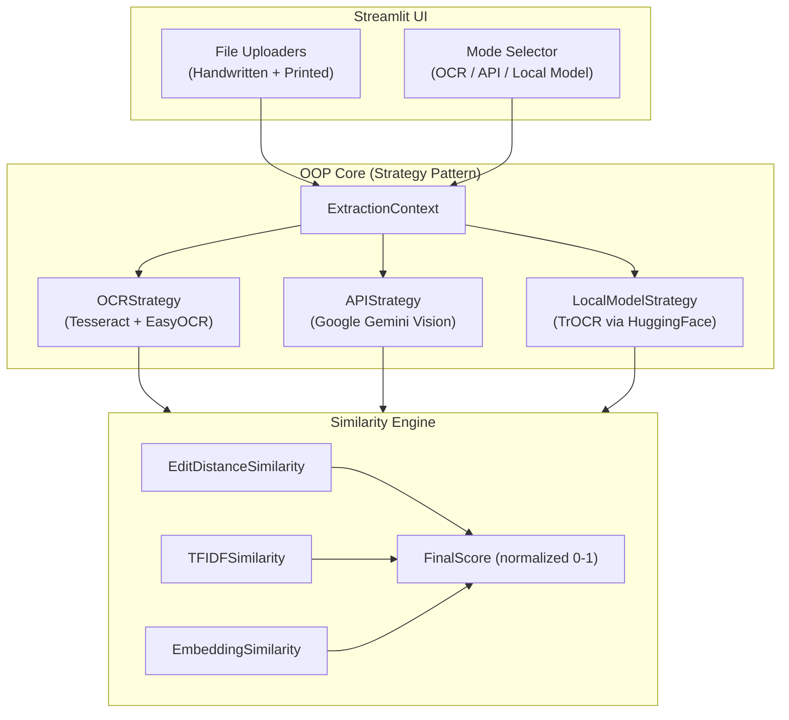

# Document Similarity Analyzer — OOPs Lab Project

A deployable Python web app that extracts text from a handwritten document and a printed document, then computes multi-metric similarity scores.

## Architecture Overview



---

## OOP Design Patterns Used

| Pattern | Where | Purpose |
|---------|-------|---------|
| **Strategy** | `OCRStrategy` ABC + 3 concrete strategies | Swap OCR engines at runtime without changing client code |
| **Factory** | `StrategyFactory` | Create the correct strategy from a mode string |
| **Template Method** | `SimilarityMetric` ABC | Define skeleton for similarity computation |
| **Facade** | `DocumentAnalyzer` | Single entry point that orchestrates extraction + similarity |

---

## User Review Required

> [!IMPORTANT]
> **API Key for Mode 2 (API Calling):** The API mode will use **Google Gemini Vision** (`gemini-2.0-flash`). You'll need a Gemini API key entered via the Streamlit sidebar. This aligns with your previous projects. Is Gemini OK, or do you prefer a different API (OpenAI GPT-4o, etc.)?

> [!WARNING]
> **Mode 3 (Local Model):** This uses Microsoft's `TrOCR` from HuggingFace Transformers. It downloads ~900MB of model weights on first run and requires PyTorch. This will be behind a feature flag so you can remove it easily if needed.

> [!NOTE]
> **System Dependencies:** OCR mode requires `tesseract-ocr` and `poppler` installed on the system (for PDF→image conversion). On macOS: `brew install tesseract poppler`.

---

## Proposed Changes

### Project Structure

```
oopslab/
├── app.py                      # Streamlit entry point
├── requirements.txt            # Python dependencies
├── config.py                   # Configuration & constants
│
├── models/                     # OOP Core
│   ├── __init__.py
│   ├── document.py             # Document dataclass
│   ├── extraction/             # Strategy Pattern for OCR
│   │   ├── __init__.py
│   │   ├── base.py             # ExtractionStrategy ABC
│   │   ├── ocr_strategy.py     # Mode 1: Tesseract + EasyOCR
│   │   ├── api_strategy.py     # Mode 2: Gemini Vision API
│   │   ├── local_model_strategy.py  # Mode 3: TrOCR
│   │   └── factory.py          # StrategyFactory
│   │
│   ├── similarity/             # Template Method for metrics
│   │   ├── __init__.py
│   │   ├── base.py             # SimilarityMetric ABC
│   │   ├── edit_distance.py    # Levenshtein edit similarity
│   │   ├── tfidf_similarity.py # TF-IDF cosine similarity
│   │   ├── embedding_similarity.py  # Sentence-BERT embeddings
│   │   └── aggregator.py       # Final normalized score
│   │
│   └── analyzer.py             # DocumentAnalyzer facade
│
├── utils/
│   ├── __init__.py
│   ├── file_handler.py         # PDF/Image loading & preprocessing
│   └── preprocessor.py         # Text cleaning utilities
│
└── assets/
    └── style.css               # Custom Streamlit styling
```

---

### Component Details

---

#### [NEW] [config.py](file:///Users/sampad/dev/oopslab/config.py)
- App title, supported file types (`.jpg`, `.jpeg`, `.pdf`)
- Feature flags: `ENABLE_LOCAL_MODEL = True` (toggle Mode 3)
- Default model names, API endpoints

---

#### [NEW] [document.py](file:///Users/sampad/dev/oopslab/models/document.py)
- `Document` dataclass: `file_name`, `file_type`, `doc_type` (handwritten/printed), `images` (list of PIL Images), `extracted_text`
- Handles both single-image and multi-page PDF inputs

---

#### [NEW] [base.py (extraction)](file:///Users/sampad/dev/oopslab/models/extraction/base.py)
- `ExtractionStrategy(ABC)` with abstract method `extract_text(images: List[Image]) -> str`
- Demonstrates **Strategy Pattern** — the core OOP concept

---

#### [NEW] [ocr_strategy.py](file:///Users/sampad/dev/oopslab/models/extraction/ocr_strategy.py)
**Mode 1 — OCR (Tesseract + EasyOCR)**
- Uses `pytesseract` for printed documents (high accuracy on clean text)
- Uses `easyocr` for handwritten documents (better than Tesseract on handwriting)
- Auto-selects engine based on `doc_type` parameter
- Preprocessing: grayscale conversion, thresholding, noise removal via OpenCV

---

#### [NEW] [api_strategy.py](file:///Users/sampad/dev/oopslab/models/extraction/api_strategy.py)
**Mode 2 — API Calling (Google Gemini Vision)**
- Uses `google-generativeai` SDK
- Sends image to `gemini-2.0-flash` with prompt: *"Extract all text from this document exactly as written. Return only the text, no formatting."*
- API key entered via Streamlit sidebar (stored in `st.session_state`)
- Handles multi-page PDFs by processing each page image separately

---

#### [NEW] [local_model_strategy.py](file:///Users/sampad/dev/oopslab/models/extraction/local_model_strategy.py)
**Mode 3 — Local Model (TrOCR)**
- Uses `transformers` library: `TrOCRProcessor` + `VisionEncoderDecoderModel`
- Model: `microsoft/trocr-large-handwritten` for handwritten, `microsoft/trocr-large-printed` for printed
- Cached via `@st.cache_resource` to avoid reloading on every run
- Guarded by `ENABLE_LOCAL_MODEL` feature flag

---

#### [NEW] [factory.py](file:///Users/sampad/dev/oopslab/models/extraction/factory.py)
- `StrategyFactory.create(mode: str, **kwargs) -> ExtractionStrategy`
- Maps `"OCR"` → `OCRStrategy`, `"API"` → `APIStrategy`, `"Local Model"` → `LocalModelStrategy`
- Demonstrates **Factory Pattern**

---

#### [NEW] [base.py (similarity)](file:///Users/sampad/dev/oopslab/models/similarity/base.py)
- `SimilarityMetric(ABC)` with:
  - `compute(text1: str, text2: str) -> float` (abstract)
  - `name` property (abstract)
- Demonstrates **Template Method Pattern**

---

#### [NEW] [edit_distance.py](file:///Users/sampad/dev/oopslab/models/similarity/edit_distance.py)
- Levenshtein edit distance using `python-Levenshtein` library
- Score = `1 - (edit_distance / max(len(text1), len(text2)))` → 0 to 1

---

#### [NEW] [tfidf_similarity.py](file:///Users/sampad/dev/oopslab/models/similarity/tfidf_similarity.py)
- `TfidfVectorizer` from scikit-learn
- Cosine similarity between TF-IDF vectors → 0 to 1

---

#### [NEW] [embedding_similarity.py](file:///Users/sampad/dev/oopslab/models/similarity/embedding_similarity.py)
- `sentence-transformers` with `all-MiniLM-L6-v2` model (~80MB, fast)
- Cosine similarity between sentence embeddings → 0 to 1
- Model cached via `@st.cache_resource`

---

#### [NEW] [aggregator.py](file:///Users/sampad/dev/oopslab/models/similarity/aggregator.py)
- `SimilarityAggregator`:
  - Takes list of `SimilarityMetric` instances
  - Computes all scores
  - **Final Score** = mean of all individual scores → normalized 0 to 1
  - Returns dict: `{metric_name: score, ..., "final_score": float}`

---

#### [NEW] [analyzer.py](file:///Users/sampad/dev/oopslab/models/analyzer.py)
- `DocumentAnalyzer` — **Facade Pattern**
  - `__init__(strategy: ExtractionStrategy, metrics: List[SimilarityMetric])`
  - `extract(doc: Document) -> str`
  - `compare(text1: str, text2: str) -> dict`
  - Single orchestration point for the Streamlit app

---

#### [NEW] [file_handler.py](file:///Users/sampad/dev/oopslab/utils/file_handler.py)
- `FileHandler.load(uploaded_file) -> List[PIL.Image]`
- PDF → images via `pdf2image.convert_from_bytes()`
- JPG/JPEG → `PIL.Image.open()`

---

#### [NEW] [preprocessor.py](file:///Users/sampad/dev/oopslab/utils/preprocessor.py)
- `TextPreprocessor`: lowercase, strip punctuation, normalize whitespace
- `ImagePreprocessor`: OpenCV grayscale, adaptive threshold, denoise

---

#### [NEW] [app.py](file:///Users/sampad/dev/oopslab/app.py)
**Streamlit UI** with:
- **Sidebar**: Mode selector (radio), API key input (for API mode), feature toggles
- **Main Area**:
  - Two columns: Left = Handwritten upload, Right = Printed upload
  - "Analyze" button
  - Results section:
    - Extracted text from Doc 1 (expandable)
    - Extracted text from Doc 2 (expandable)
    - Similarity scores displayed as metric cards with animated progress bars
    - Final Score with a large gauge/radial chart
- **Styling**: Dark theme, glassmorphism cards, gradient accents, smooth animations

---

#### [NEW] [style.css](file:///Users/sampad/dev/oopslab/assets/style.css)
- Custom CSS for premium dark theme
- Glassmorphism card effects
- Animated progress bars for similarity scores
- Custom font (Inter from Google Fonts)

---

#### [NEW] [requirements.txt](file:///Users/sampad/dev/oopslab/requirements.txt)
```
streamlit>=1.30.0
pytesseract>=0.3.10
easyocr>=1.7.0
pdf2image>=1.16.3
Pillow>=10.0.0
opencv-python-headless>=4.8.0
scikit-learn>=1.3.0
sentence-transformers>=2.2.0
python-Levenshtein>=0.21.0
google-generativeai>=0.8.0
transformers>=4.35.0
torch>=2.1.0
numpy>=1.24.0
```

---

## Verification Plan

### Automated Tests
1. Run `streamlit run app.py` and verify the app launches without errors
2. Upload a sample handwritten JPG and printed PDF
3. Test all 3 modes work end-to-end
4. Verify all 4 similarity scores produce valid 0–1 values

### Manual Verification
- Visual demo in the browser recording showing:
  - File upload flow
  - Mode switching
  - Text extraction results
  - Similarity score display with animations
